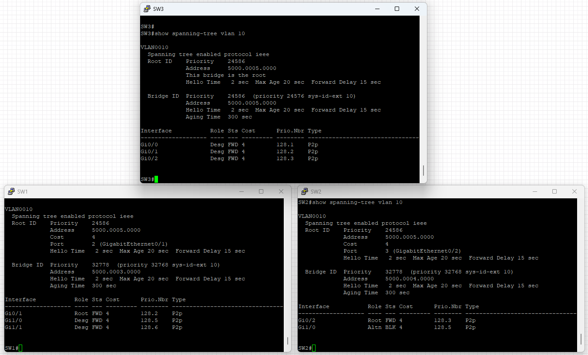

# Самостоятельная работа 1

Структура:

Клиенты пингуют друг друга:

vlan сконфигурированы согласно заданию (порты которые не показываются в списке находятся в режиме trunk)

spanning tree работает корректно и в обоих сетях корневой вершиной является центральная вершина сети

Центральный линк заблокирован

Однако если убрать одно из соединений, то spanning tree перестроится и система по-прежнему будет работать

